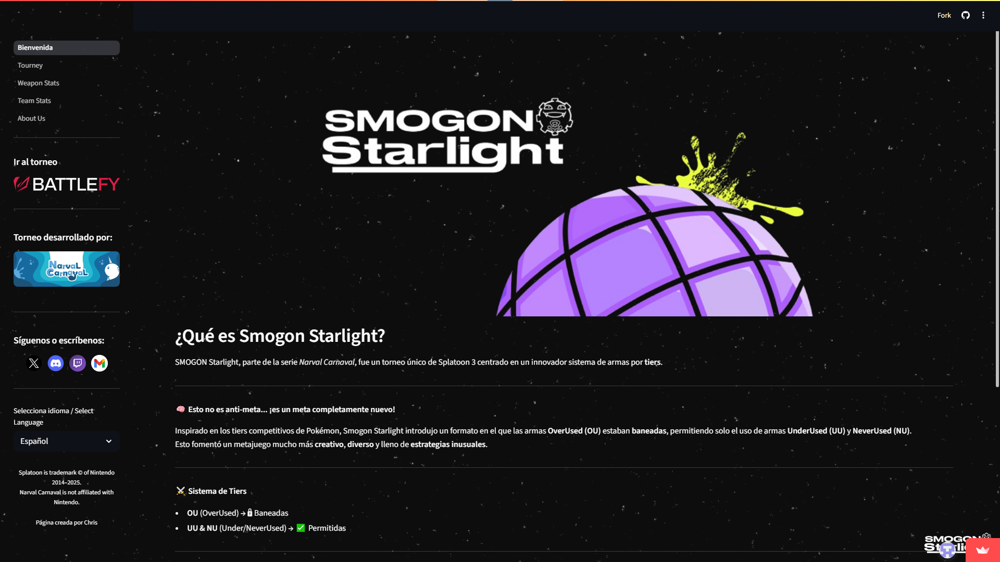
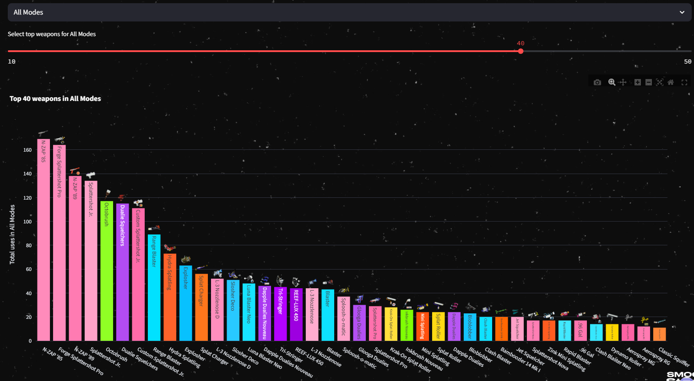
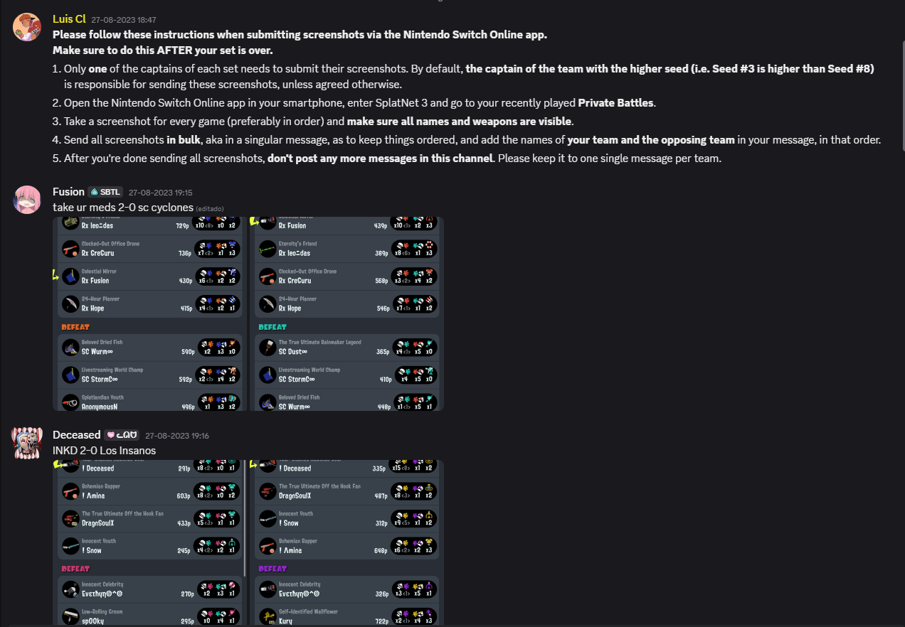
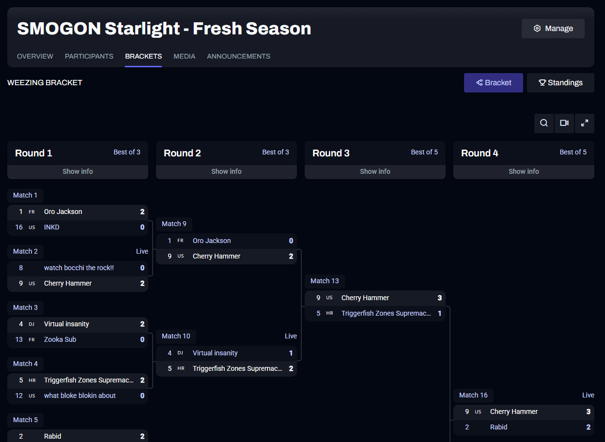

# Smogon Starlight - Análisis de Torneo de Splatoon 3

[](https://smogon-starlight.streamlit.app/)

Este repositorio contiene el código para una aplicación web desarrollada en Streamlit que visualiza y analiza los datos del torneo de Splatoon 3 **"Smogon Starlight"**. La aplicación permite explorar de manera interactiva las estadísticas de uso de armas, el rendimiento de los jugadores y las tendencias generales del torneo.

**➡️ Accede a la aplicación en vivo aquí: [https://smogon-starlight.streamlit.app/](https://smogon-starlight.streamlit.app/)**

---

## 🖼️ Vista Previa de la Aplicación

A continuación, se muestran algunas capturas de pantalla de la interfaz y las visualizaciones que ofrece la aplicación.

**Interfaz principal de la aplicación:**


**Ejemplo de visualización de datos:**


---

## 📄 Documentación y Características

El objetivo de este proyecto es proporcionar una herramienta visual para que los organizadores, participantes y la comunidad de Splatoon 3 puedan analizar los datos de un torneo de manera sencilla e intuitiva.

### Características Principales
- **Dashboard Interactivo:** Toda la información se presenta en una interfaz amigable y fácil de navegar.
- **Filtros Dinámicos:** Los usuarios pueden filtrar los datos por jugador, país, arma, clase de arma y más.
- **Estadísticas Detalladas:** Cálculo de estadísticas clave como K/D Ratio, Winrate, popularidad de armas y especiales.
- **Visualizaciones Claras:** Uso de gráficos de barras y tablas para presentar la información de forma efectiva.

### Estructura del Repositorio
```
├── 0_Bienvenida.py         # Página principal de bienvenida
├── pages/ # Páginas desplegables
│   ├── 1_Tourney.py            # Torneo General
│   ├── 2_Weapon_Stats.py       # Estadísticas de Armas
│   ├── 3_Team_Stats.py         # Estadísticas de Equipos
│   ├── 4_About_Us.py           # Sobre Nosotros
├── utils/                  # Módulos de utilidad
│   ├── __init__.py
│   ├── data_loader.py      # Lógica para cargar datos
│   ├── ui.py               # Componentes de UI reutilizables
│   └── viz.py              # Lógica para crear visualizaciones
├── data/                   # (Carpeta para archivos .xlsx)
├── images/                 # (Carpeta para imágenes .png, .jpg)
├── videos/                 # (Carpeta para videos .mp4)
├── requirements.txt        # Dependencias de Python
├── .gitignore              # Archivos a ignorar por Git
└── README.md               # Este archivo
└── LICENSE.md              # Licencia del programa
```
---

## 📊 Fuentes de Datos

La información utilizada en esta aplicación se recopiló de diversas fuentes, asegurando la integridad y precisión de los datos del torneo.

#### 1. Datos de Uso de Armas
Los datos de uso de armas, Kills y Deaths (`data/data.xlsx`) fueron recopilados manualmente por los organizadores del torneo. Se solicitó a los participantes que enviaran capturas de pantalla de sus armas utilizadas a través de un canal de Discord, las cuales fueron transcritas a una hoja de cálculo.



#### 2. Datos del Torneo (Brackets y Jugadores)
La información sobre los brackets del torneo y los países de los participantes se extrajo de la página oficial del torneo en **Battlefy**, también proporcionada por los organizadores.



#### 3. Parámetros y Especificaciones de Armas
Las especificaciones detalladas de cada arma (clase, arma secundaria, arma especial) se obtuvieron de la exhaustiva base de datos de Splatoon 3 mantenida por **Leanny**.
- **Fuente:** [https://leanny.github.io/splat3/database.html](https://leanny.github.io/splat3/database.html)

---

## 🚀 Instrucciones para Ejecución Local

Si deseas ejecutar esta aplicación en tu propia máquina, sigue estos pasos:

1.  **Clonar el repositorio:**
    ```bash
    git clone https://github.com/cperezfl/smogon-starlight.git
    ```

2.  **Navegar al directorio del proyecto:**
    ```bash
    cd /tu-directorio-smogon-starlight
    ```

3.  **(Recomendado) Crear y activar un entorno virtual:**
    - En Windows:
      ```bash
      python -m venv venv
      .\venv\Scripts\activate
      ```
    - En macOS y Linux:
      ```bash
      python3 -m venv venv
      source venv/bin/activate
      ```

4.  **Instalar las dependencias necesarias:**
    ```bash
    pip install -r requirements.txt
    ```

5.  **Ejecutar la aplicación Streamlit:**
    ```bash
    streamlit run 0_Bienvenida.py
    ```

Una vez ejecutado el último comando, la aplicación se abrirá automáticamente en tu navegador web para ejecutarse de manera local.
